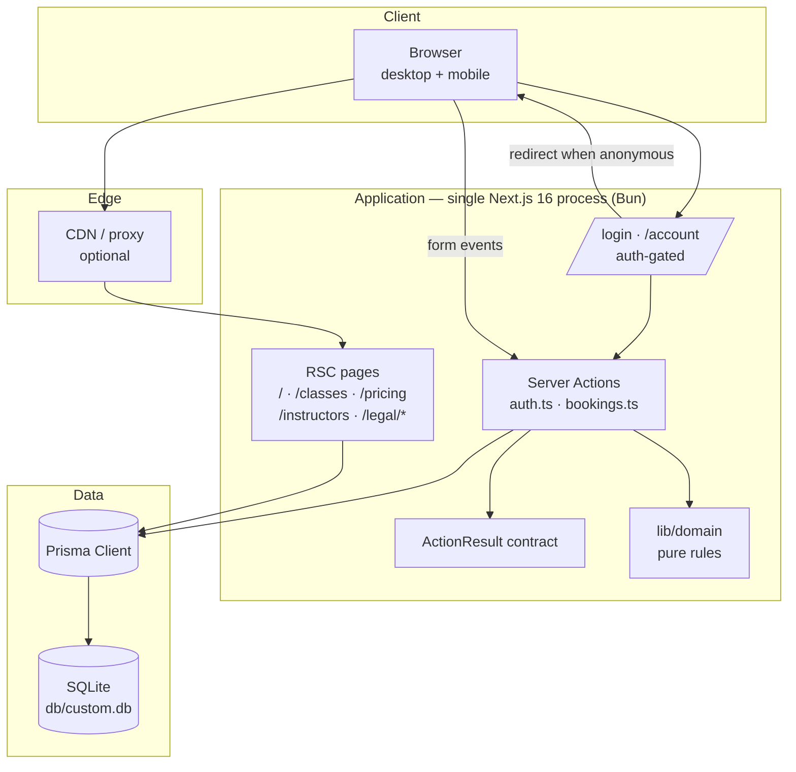
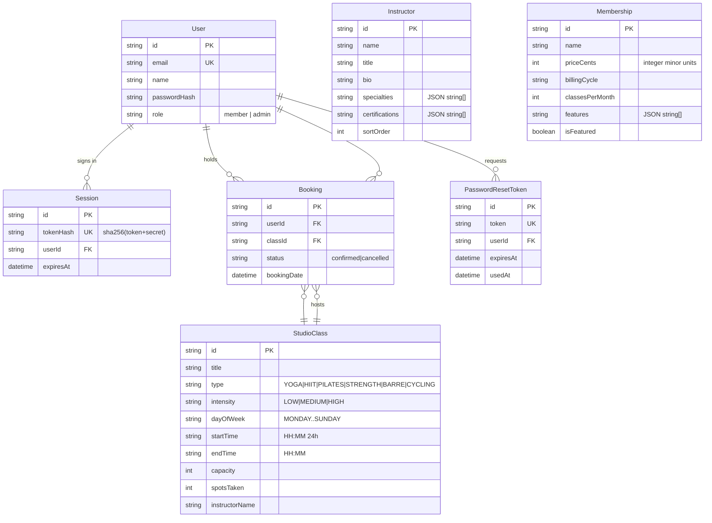

# AURA Studio (fitness-studio-new) — Master Project Architecture Document (PAD) v1.0

**Classification:** Internal Engineering Reference
**Status:** DEFINITIVE, PRODUCTION-LOCKED BLUEPRINT
**Companion Document:** README.md (onboarding), AGENTS.md (agent instructions), CLAUDE.md (conventions)
**Last Updated:** 2026-09-19
**Audience:** Senior Engineers, Tech Leads, DevOps, and Onboarding Engineers
**Rule:** Every architectural decision in this document traces to a specific rationale.
           Nothing is here "because it's popular."

---

## Table of Contents

1. [System Overview & Decisions](#1-system-overview--decisions)
2. [High-Level System Topology](#2-high-level-system-topology)
3. [Application Architecture](#3-application-architecture)
4. [Data Architecture](#4-data-architecture)
5. [Design System Reference](#5-design-system-reference)
6. [Security Architecture](#6-security-architecture)
7. [Testing Strategy](#7-testing-strategy)
8. [Build & Deployment](#8-build--deployment)
9. [Developer Handbook](#9-developer-handbook)
10. [Known Issues & Outstanding Tasks](#10-known-issues--outstanding-tasks)
11. [Key Files Reference](#11-key-files-reference)
12. [Glossary](#12-glossary)

---

## 1. System Overview & Decisions

### 1.1 Document Metadata & Purpose

This PAD documents `fitness-studio-new` — a from-scratch Next.js 16 rebuild of the Base44-hosted "AURA Studio" app at `fitness-studio.base44.app`. The source was reconnoitered live (every route snapshot, its CSS `:root` token block, its four Base44 entity schemas probed via the public API), and this codebase reproduces its surfaces with production semantics: real authentication, transactional bookings, seeded schedule data.

**How to use this document:**
- **New engineer** — read §2, §3, §9; run the Quick Start in README.md.
- **Debugging** — §3.3 (critical patterns), §6 (security), §10 (known issues).
- **Reviewing tech choices** — §1.3 ADRs record why each decision was made and what was rejected.

### 1.2 Technology Stack Summary

| Layer | Technology | Version | Key Rationale |
|---|---|---|---|
| Package manager | Bun | ≥ 1.1 | Single runtime for install/dev/test; fastest cold start in the sandbox |
| Web framework | Next.js (App Router) | 16.1.x | RSC-first matches the "server is the source of truth" principle; Server Actions remove the need for a REST layer |
| UI runtime | React | 19.x | Required by Next 16; `useTransition` drives non-blocking filter navigation |
| Language | TypeScript (strict) | 5.x | Compile-time contract enforcement across the action boundary |
| Styling | Tailwind CSS | 4.x | CSS-first `@theme` maps the extracted HSL tokens 1:1; no config file drift |
| Component primitives | shadcn-style (Radix) | — | Toast/sonner and layout primitives without bespoke ARIA work |
| ORM | Prisma | 6.x | Typed client; `db push` suits the SQLite dev loop; schema is Postgres-portable |
| Database | SQLite | (system) | Zero-config single-file persistence; adequate for single-instance deployment |
| Validation | Zod | 4.x | One schema per action input; `toFieldErrors` bridges to form errors |
| Auth | hand-rolled scrypt + HMAC sessions | — | No third-party dependency; no account-existence oracle; DB stores token fingerprints only |
| Unit tests | Vitest | latest | Fast, ESM-native; tests the pure domain seam |
| Fonts | Taviraj + Inter | via `next/font/google` | Exact source-site typography, self-hosted, zero CLS |
| Toasts | sonner | 2.x | Accessible live-region notifications for action feedback |

### 1.3 Architecture Decision Records

**ADR-001: Single Next.js App Router app (no monorepo)**

- **Context:** The foundation repo (scandihaven) is a Turborepo monorepo. The clone has one deployable surface and a four-model domain.
- **Decision:** Single Next.js 16 application; layering enforced by directory conventions (`app → components → lib/domain → lib/db`), not workspace boundaries.
- **Rationale:** The monorepo's cost (turbo graph, transpilePackages, cross-package lint) buys nothing at this scale. The scandihaven *invariants* (ActionResult, pure domain, integer money) were kept; its *structure* was not.
- **Consequences:** Simpler CI and onboarding; boundary drift is caught by review rather than the build. A second app (e.g. admin) would justify revisiting.
- **Alternatives Rejected:** Turborepo clone of scandihaven (overhead), Vite SPA + API (loses RSC/Server Actions).

**ADR-002: Server Actions with a discriminated-union result contract**

- **Context:** Mutations (sign-up, sign-in, book, cancel) cross a network boundary; throwing there produces opaque client errors.
- **Decision:** Every action returns `ActionResult<T> = { ok: true; data: T } | { ok: false; error: ActionError }`; `withResult()` wraps the body, logging internals server-side and returning customer-safe `INTERNAL` copy on unexpected failure.
- **Rationale:** Adopted verbatim from scandihaven's proven pattern — the client can never receive a stack trace, and error codes (`CAPACITY_FULL`, `CONFLICT`, …) drive UX (toast copy, redirect-to-login) instead of string matching.
- **Consequences:** One extra unwrapping layer in client handlers; total absence of try/catch noise in components.
- **Alternatives Rejected:** tRPC (adds a client/protocol for six endpoints), REST route handlers (loses colocation and RSC cache integration).

**ADR-003: Hand-rolled session auth (scrypt + HMAC-fingerprinted opaque tokens)**

- **Context:** The source app uses Base44's managed auth with a Google option. This deployment has no OAuth provider configured and must not depend on one.
- **Decision:** scrypt password hashing (N=16384, self-describing hash format); 32-byte random session tokens in httpOnly cookies; DB stores only `sha256(token + SESSION_SECRET)`; 30-day expiry with opportunistic sweep; password reset mints single-use tokens logged to the server channel.
- **Rationale:** Zero third-party auth surface to audit or rotate; a database leak cannot be replayed as sessions (tokens are unrecoverable from fingerprints); uniform error copy eliminates account enumeration.
- **Consequences:** No social sign-in (the login card says so honestly); no email delivery in this environment (reset tokens are operator-logged). NextAuth would return if Google sign-in becomes a requirement.
- **Alternatives Rejected:** NextAuth v4 (present in scaffold; unconfigured providers add attack surface), JWT in localStorage (XSS-exfiltratable).

**ADR-004: Transactional booking writes with a DB-level duplicate guard**

- **Context:** Two concurrent members booking the last spot, or double-clicks on the BOOK button, must not oversell a class.
- **Decision:** The capacity check, duplicate check, booking insert, and `spotsTaken` increment run inside one `db.$transaction`; `@@unique([userId, classId])` is the final backstop; the UI also derives "Booked ✓" from server data.
- **Rationale:** Read-then-write outside a transaction races; the unique constraint turns any race survivor into a typed `CONFLICT` instead of a double booking. SQLite serializes writers, and the pattern ports unchanged to Postgres.
- **Consequences:** `spotsTaken` is denormalized state — only the transaction keeps it honest; cancellation decrements inside the same transaction shape.
- **Alternatives Rejected:** Counting bookings per read (N+1 on the schedule), optimistic UI without server guard (oversell).

**ADR-005: Pure domain seam under the actions**

- **Context:** Filters, capacity rules, cancellation windows, money, and JSON-column parsing are logic worth testing; Prisma models are not importable in a pure unit test without a DB.
- **Decision:** `src/lib/domain/` holds `class-filters.ts` and `booking-rules.ts` — zero I/O imports, fully typed, covered by `tests/domain.test.ts` (24 tests).
- **Rationale:** The scandihaven discipline (commerce package as pure seam) scaled down to two modules; tests run in milliseconds with no fixtures, and the same functions serve both server pages and client components (`formatTimeClock` is used in both).
- **Consequences:** Actions become thin orchestrators (validate → transaction → revalidate); domain bugs are reproducible without a browser.
- **Alternatives Rejected:** Testing through the browser only (slow, flaky), testing Prisma queries with a live DB (couples tests to I/O).

**ADR-006: Design tokens extracted from the source, not approximated**

- **Context:** The clone must match the original's look without access to its source code.
- **Decision:** Tokens were read from the deployed app's CSS `:root` (HSL values) and reproduced verbatim in `globals.css`; fonts identified from the bundle (`Taviraj`, `Inter`); section copy captured from live accessibility snapshots; photography downloaded from the source CDN and re-optimized (41 MB → 3 MB, 1600px, q82).
- **Rationale:** Screenshot approximations drift; the source's own variables are ground truth. A VLM comparison of clone vs original scored palette 9/10 and typography 9/10.
- **Consequences:** Gradient section backgrounds are inline styles (`linear-gradient(to top, #FFFAA4, #F6BF8E)`) matching the source's non-token accents.
- **Alternatives Rejected:** Theme guesses from screenshots (drift), hotlinking the source CDN (fragile, impolite).

---

## 2. High-Level System Topology



**Runtime and scaling characteristics:**
- One Node/Bun process serves RSC renders and action POSTs; SQLite colocates storage with compute — correct for single-instance deployment (the whole app is one container).
- Session lookups are one indexed `findUnique` per request (tokenHash is `@unique`); no cache layer is needed at this traffic class.
- The schedule page is `force-dynamic` (booking state must be current); all marketing pages are static-rendered RSC with image optimization at build.

---

## 3. Application Architecture

### 3.1 The Layer Model

```
Layer 0: Routes (src/app)          — RSC pages + metadata. Read via db, render server components.
                                    Rule: no direct fetch/mutation logic here; pages compose.
Layer 1: Server Actions (src/actions) — the ONLY mutation boundary. async-only exports.
                                    Rule: validate (Zod) → authorize → transact → revalidate; return ActionResult.
Layer 2: Domain (src/lib/domain)   — pure rules: filters, booking guards, money, time.
                                    Rule: no I/O imports (no prisma, no next/headers). The unit-tested seam.
Layer 3: Infrastructure (src/lib)  — db client, auth primitives, validation schemas, result contract.
                                    Rule: importable by Layers 0-2; imports only external packages.
Layer 4: Components (src/components/site) — client leaves ('use client') for interactivity.
                                    Rule: receive data via props; communicate mutations via actions; never derive truth twice.
```

**The Golden Rule:** dependencies point downward (`app → actions → domain → infrastructure`). A domain module importing the db client breaks the test seam and is rejected in review.

### 3.2 Annotated Directory Structure

```
├── prisma/
│   └── schema.prisma           ← 6 models; @@unique(userId,classId) backs the duplicate guard
├── public/
│   └── images/                 ← 20 optimized assets (hero, 4 disciplines, sky, 4 coaches, 7 gallery,
│                                  footer + class-packs backdrops, logo)
├── scripts/
│   └── seed.ts                 ← Idempotent: upsert instructors/memberships by id, classes by natural key
├── src/
│   ├── actions/
│   │   ├── auth.ts             ← signUp / signIn / signOut / requestPasswordReset (+ safeRedirect local)
│   │   └── bookings.ts         ← createBooking / cancelBooking (transactional) + listMyBookings read
│   ├── app/
│   │   ├── page.tsx            ← Home: hero → free week → disciplines (dial) → sky → benefits →
│   │   │                          coaches (accordion) → testimonials → gallery (collage) — no trailing CTA
│   │   ├── classes/page.tsx    ← Espresso band + searchParams → normalizeFilters → server-filtered cards
│   │   ├── pricing/page.tsx    ← 5 bands: espresso hero / first-timer / plans / packs-on-photo / policies
│   │   ├── instructors/page.tsx← Espresso band + philosophy + roster from DB (anchor ids match home links)
│   │   ├── login/page.tsx      ← Auth shell (redirects authenticated users to /account)
│   │   ├── account/page.tsx    ← My bookings (auth-gated; redirect to /login?redirect=/account)
│   │   ├── privacy|terms|accessibility/  ← Legal pages at the source's routes
│   │   ├── legal/              ← permanentRedirect stubs to the new legal routes
│   │   ├── not-found.tsx       ← Branded 404 (big 404, rule, message, Go home)
│   │   ├── layout.tsx          ← Root: Taviraj + Inter via next/font, metadata template
│   │   └── globals.css         ← HSL token block + @theme inline + utilities + keyframes
│   ├── components/site/
│   │   ├── header.tsx          ← Fixed, hide-on-scroll past 64px; centered Taviraj wordmark (breathe);
│   │   │                          custom 3-line burger; cream dropdown menu + studio hours
│   │   ├── footer.tsx          ← Photo backdrop + layered glowing SVG "AURA STUDIO" wordmark + 3 columns
│   │   ├── schedule-browser.tsx← 'use client': pill filter rails → URL; BOOK buttons → action → toast
│   │   ├── auth-card.tsx       ← signin|signup|reset modes; Google button (inert, honest toast) + OR divider
│   │   ├── booking-row.tsx     ← Account booking + cancel
│   │   ├── disciplines-section.tsx ← Sticky circular dial (scrollspy) + 4 stacked image cards
│   │   ├── benefits-carousel.tsx  ← Coverflow slots (±340/680/1020px, scale 0.92/0.84/0.76)
│   │   ├── coaches-section.tsx   ← Interactive accordion, spring-open info panels (row-reverse alternates)
│   │   ├── gallery-section.tsx   ← Scattered collage (mask fades, mouse parallax) + lightbox
│   │   ├── legal-page.tsx        ← Shared legal shell (espresso band + prose sections)
│   │   ├── aura-button.tsx     ← Measured button spec: rounded, 0.1em→0.2em tracking, arrow-up-right
│   │   └── sign-out-button.tsx
│   ├── lib/
│   │   ├── auth/passwords.ts   ← scrypt hash/verify (self-describing format)
│   │   ├── auth/session.ts     ← create/get/destroy; SHA-256(token+secret) fingerprinting
│   │   ├── domain/class-filters.ts  ← normalizeFilters (case-insensitive), filterClasses, sortClasses, formatTimeClock
│   │   ├── domain/booking-rules.ts  ← checkBooking, spotsLeft, checkCancellation, formatMoney, parseJsonArray
│   │   ├── domain/discipline-wheel.ts ← labelAngle / wheelRotation / shortestRotationDelta (pure, tested)
│   │   ├── result.ts           ← ActionResult union, ok/err builders, withResult wrapper
│   │   ├── validation.ts       ← Zod schemas + toFieldErrors
│   │   └── db.ts               ← Prisma singleton (HMR-safe)
│   └── app/api/                ← Scaffold health route only (no UI-mutation endpoints)
├── tests/
│   └── domain.test.ts          ← 24 tests over the pure seam
├── vitest.config.ts            ← Scopes the suite to tests/ (excludes scratch/)
├── docs/                       ← SSH push runbook + wrapper (repository operations)
└── skills/                     ← The documentation-generation skills that produced these docs
```

### 3.3 Critical Code Patterns

**Pattern 1 — The ActionResult contract (every mutation):**

```typescript
// src/lib/result.ts — the client boundary contract. Actions never throw across it.
export type ActionResult<T = undefined> =
  | { ok: true; data: T }
  | { ok: false; error: ActionError }

export async function withResult<T>(
  fn: () => Promise<ActionResult<T>>,
  context: string,
): Promise<ActionResult<T>> {
  try {
    return await fn()
  } catch (error) {
    // Internals never reach the client; operator detail stays server-side.
    console.error(`[action:${context}]`, error)
    return err('INTERNAL', 'Something went wrong on our side. Please try again.')
  }
}
```

*Why this pattern:* the client switches on `result.ok` and dispatches on `error.code` (`UNAUTHENTICATED` → redirect to login; `CAPACITY_FULL`/`CONFLICT` → toast the customer-safe message). No stack traces, no string sniffing, no dead ends.

**Pattern 2 — Transactional booking with the pure guard inside:**

```typescript
// src/actions/bookings.ts — guard and write commit atomically.
const result = await db.$transaction(async (tx) => {
  const cls = await tx.studioClass.findUnique({
    where: { id: parsed.data.classId },
    include: { bookings: { where: { status: 'confirmed', userId: user.id } } },
  })
  if (!cls) return err('NOT_FOUND', 'That class no longer exists.')

  // Pure domain rule — spotTaken/capacity/duplicate in one decision.
  const check = checkBooking(cls, cls.bookings.length > 0)
  if (!check.allowed && check.reason) {
    return err(
      check.reason === 'DUPLICATE' ? 'CONFLICT' : 'CAPACITY_FULL',
      bookingDenyMessage(check.reason),
    )
  }

  const booking = await tx.booking.create({ data: { userId: user.id, classId: cls.id } })
  await tx.studioClass.update({ where: { id: cls.id }, data: { spotsTaken: { increment: 1 } } })
  return ok({ bookingId: booking.id, spotsLeft: check.spotsLeft })
})
if (result.ok) revalidatePath('/classes')
```

*Why this pattern:* the read-guard-write sequence is one transaction, so concurrent bookers serialize; the `@@unique` constraint converts any residual race into a typed `CONFLICT`. The pure `checkBooking` keeps the rule unit-testable while the action stays an orchestrator.

**Pattern 3 — URL-synced server-rendered filters:**

```typescript
// src/app/classes/page.tsx — filters live in the URL, rendering happens on the server.
const params = await searchParams                       // Next 16: async searchParams
const filters = normalizeFilters(params)                // fails open on unknown values
const [allClasses, user] = await Promise.all([db.studioClass.findMany({...}), getCurrentUser()])
const visible = filterClasses(/* mapped shape */, filters)  // pure filter over the fetched set
```

```typescript
// src/components/site/schedule-browser.tsx — the client only pushes the query.
const setFilter = (axis, value) => startTransition(() => router.push(qs ? `/classes?${qs}` : '/classes', { scroll: false }))
```

*Why this pattern:* filter state is shareable (`/classes?type=YOGA` links from the disciplines section), survives refresh, and renders correctly without JS. `normalizeFilters` treats unknown enum values as absent — a tampered query string shows the full schedule instead of a 500.

**Pattern 4 — HMAC-fingerprinted sessions:**

```typescript
// src/lib/auth/session.ts — the cookie carries the token; the DB carries only its fingerprint.
export function hashToken(token: string): string {
  return createHash('sha256').update(`${token}${sessionSecret()}`).digest('hex')
}
```

*Why this pattern:* a leaked database yields fingerprints, not usable tokens; a stolen cookie is useless after `SESSION_SECRET` rotation. `getCurrentUser()` is the single auth read seam, and it opportunistically sweeps expired sessions so the table self-cleans.

---

## 4. Data Architecture

### 4.1 Database Schema



### 4.2 Data Models — source mapping

The four domain entities mirror the Base44 source's schemas, probed live via its API validation errors: `StudioClass` (type/intensity/day_of_week/start_time/end_time/capacity/spots_taken/description/instructor_name/requirements), `Instructor` (name/title/bio/philosophy/specialties/certifications/sort_order/image_url), `Membership` (name/price/billing_cycle/classes_per_month/features/is_featured/sort_order), `Booking` (user_email/class_title/user_name/class_id/status/booking_date). Booking was normalized to proper relations (`userId`/`classId` FKs instead of denormalized email/title strings) — the only deliberate divergence, made to enforce integrity the source could not.

### 4.3 Persistence Strategy

- **Dev flow:** `bun run db:push` (schema-first; no migration files) then `bun run scripts/seed.ts`. The seed is idempotent — instructors/memberships upsert by stable id, classes by natural key (title + day + startTime) — safe to re-run after schema pushes.
- **Connection management:** one PrismaClient singleton (`src/lib/db.ts`) stored on `globalThis` in dev to survive HMR.
- **Enums as strings + CHECK-by-validation:** SQLite lacks enums; allowed values are enforced in the domain (`CLASS_TYPES`, `INTENSITIES`, `DAYS_OF_WEEK` const arrays) and validated at every read via `normalizeFilters`.
- **JSON array columns:** `specialties`/`certifications`/`features` are JSON strings; the ONLY (de)serialization path is `parseJsonArray`/`serializeJsonArray` (defensive: malformed JSON returns `[]`, non-strings are dropped).
- **Portability:** change `provider` to `postgresql` + set `DATABASE_URL` and the schema ports as-is; the transaction patterns rely only on serializable single-writer semantics SQLite already provides.

---

## 5. Design System Reference

### 5.1 Typographic System

| Role | Typeface | Weights | Usage |
|---|---|---|---|
| Display / headings | Taviraj (serif) | 300 light (hero display: 200 extralight) | Page h1s (`text-5xl md:text-7xl font-light leading-tight`), section h2s, coach names, plan names — **non-italic**; italic reserved for testimonial quotes and Inhale/Exhale |
| Body / UI | Inter (sans) | 300/400/500/600 | Paragraphs, buttons, filter rails, dial labels |
| Micro-label (`.kicker`) | Inter 500 | 12px, uppercase, `0.3em` tracking | Section eyebrows ("THE DISCIPLINES", "WHY AURA") |

### 5.2 Color Tokens

| Token | HSL / Hex | Usage | Contrast |
|---|---|---|---|
| `--primary` | `hsl(21 93% 13%)` / `#411401` | Espresso — buttons, headings, footer gradient end, overlay wash | on cream: 13.1:1 ✦ AAA |
| `--primary-foreground` | `hsl(40 25% 94%)` / `#F0EFE9` | Cream text on espresso | (pair above) |
| `--background` | `hsl(40 25% 94%)` / `#F4F1EC` | Page background | — |
| `--accent` | `hsl(57 100% 82%)` / `#FFFAA4` | Butter yellow — free-week gradient end, benefit field | decorative |
| `--ring` | `hsl(15 52% 53%)` | Terracotta — focus rings, MEDIUM intensity badge | 3.2:1 (large/UI) |
| `--secondary` | `hsl(15 22% 84%)` | Taupe — section tints, testimonial field | — |
| `--muted-foreground` | `hsl(270 8% 48%)` | Descriptions, meta text | 4.6:1 on cream ✦ AA |
| Gradient A | `135deg, #FFFAA4 → #F0EFE9` | First-timer band on /pricing (inline style, matches source) | decorative |
| Gradient B | `to bottom, #F0EFE9 → #FFFAA4` | Benefits field ("Built different") | decorative |
| Free-week glow | `to top, #F6BF8E → #FFFAA4`, blur(60px), ellipse rising from the bottom | Home "Your first week free" backdrop | decorative |
| Coach panel | `#DAC2B9 → #F0EFE9` | Accordion info panels + instructor cards | decorative |
| Photo backdrops | `footer-bg.jpg` (footer), `packs-bg.jpg` (class packs), `testimonials-bg.jpg` (Proof-of-Power band under `bg-black/20`) | Full-bleed photography under soft dark washes | decorative |

### 5.3 Component Primitives

- `AuraButton` — measured source spec: **dark** (espresso fill), **light** (cream fill for dark/photo fields), **outline** (1px espresso border). All: `rounded` (6px), `px-6 py-2.5 text-xs uppercase`, tracking `0.1em` easing to `0.2em` on hover, arrow-up-right glyph that lifts on hover.
- Header — `fixed top-0`, h-16, centered Taviraj wordmark running the 7.2s breathe pulse, custom three-line burger (w-6/w-6/w-4 hairlines) on the right. Transparent + white over each page's espresso hero band; past 64px of scroll it swaps to cream+espresso and slides out (`translateY(-100%)`, opacity 0), returning at the top. Menu = cream dropdown panel (Taviraj 28px links, solid Book-a-class button, studio hours; a discreet "Sign in / My bookings" link is the clone's functional addition).
- Filter rails — `aria-pressed` rounded-full pill toggles; selected = espresso fill.
- Cards — `rounded-xl`/`rounded-2xl` with 1px `--border`/50; intensity badges color-coded (LOW butter / MEDIUM terracotta / HIGH destructive); benefit cards carry the warm shadow `rgba(230,146,76,0.12) 0 12px 20px 4px`.
- Discipline dial — sticky circular selector; labels at `index × 90°` ride the circle, dial counter-rotates `-(active × 90°)` (accumulated via shortest-path deltas), click scrolls to the matching card (scrollspy via IntersectionObserver). Below the card stack, a right-aligned **All classes** dark AuraButton (measured: 115px off the right gutter at 1440px) links to `/classes`.
- Benefits coverflow (session 6 re-measure) — an `h-96` (384px) `overflow-hidden` stage centers the 384×320 white cards (slot geometry unchanged: translateX ±340/680/1020, scale 0.92/0.84/0.76, opacity 0 past ±2); BELOW the stage, `gap-12` down, a desktop-only controls row spans the full width: round `w-10 h-10 md:w-11 md:h-11` prev/next buttons carrying the source's long-arrow glyph (hairline + open arrowhead, 1px non-scaling stroke, previous rotated 180°) at the gutters, flanking a passive dot rail (`gap-3`: active 10px `#411401` fill, inactive 8px espresso border — the source's dots are non-interactive divs; the buttons drive rotation). Mobile stacks all six cards (`px-6 py-8`, `gap-6`) with no controls.
- Coaches accordion (session 6 re-measure) — coaches sit in `justify-between` **rows of two** (`gap: 28px`, `mb-8` between rows; a single row would overflow the 1170px container — the source wraps identically). Each row is an **independent accordion**: clicking a coach swaps the active card only within its row. The default active alternates down the page (row 1 opens its first card, row 2 its last — the source's diagonal composition). The active card springs to ~807px (`cubic-bezier(0.34,1.56,0.64,1)`, 0.5s) revealing the gradient panel; a second-slot card opens mirror-image (row-reverse) so the panel grows into the row.
- Legal pages (session 6 re-measure) — the source's legal routes are cream prose pages, not espresso bands: `bg-background pt-24 pb-16` wrapper, `max-w-3xl mx-auto px-6 md:px-[8vw]` column, Title-Case h1 `text-4xl md:text-5xl font-light text-primary mb-12` (48px at desktop), then `space-y-10` sections of h2 `text-2xl font-light mb-4` + body 16px/26px `text-primary/80`. The header takes `forceSolid` (the source's transparent+white wordmark over cream is invisible — the same platform bug as its 404).
- Footer copyright row (session 6 re-measure) — inside the columns' `px-6 md:px-[8vw] py-8 md:py-16` container: `mt-16` above a `border-t border-[#F0EFE9]/90` hairline, `pt-8`, `flex-col md:flex-row items-start md:items-center justify-between gap-4`, legal links stack on mobile (`flex-col md:flex-row gap-6`), full-opacity `text-xs`.
- Testimonial spotlight — the source's PROOF OF POWER band: full-bleed photo under `bg-black/20`, **white** kicker/h2, three 260px `rounded-2xl` cards on a `gap-[26px]` grid. Before the band enters the viewport every card shows its quote face (cream card, Taviraj-200 italic quote, name + result over a hairline rule). Once revealed (IntersectionObserver, skipped under reduced motion), a ~3s-slot rotation lights one card's quote at a time while the other two dissolve to giant Taviraj-200 cream numbers (`1`/`2`/`3`, 60px) over the photo with a cream hairline border — both layers crossfading 1200ms ease-in-out. Hover or keyboard focus freezes the cycle on that card (only its quote visible, active index notwithstanding). State math in `lib/domain/testimonial-spotlight.ts` (tested); the number spans are `aria-hidden`.
- 404 screen — the source renders its platform's default NotFound inside the AURA chrome: a full-viewport `min-h-screen flex items-center justify-center p-6` `slate-50` field (content centered at the viewport midpoint; the footer starts below the fold), `text-7xl font-light text-slate-300` digits, a `w-16 bg-slate-200` rule, "Page Not Found" (`text-2xl font-medium text-slate-800`), the quoted offending path **without its leading slash** (`formatNotFoundCopy`, read client-side via `usePathname` in `not-found-message.tsx`), and a white `Go Home` button (`border-slate-200`, home icon, `text-sm font-medium text-slate-700`). The header takes `forceSolid` on this page — the source's transparent+white wordmark over the light field is invisible (a source bug we fix, consistent with the menu-chrome fix). The closed header menu is `inert` everywhere (session 6: `aria-hidden` alone left the hidden links tab-focusable — an invisible-focus WCAG violation).
- Gallery collage — 285px-wide photos placed by left/top %, mask-image bottom fades, mouse parallax (per-image depth), lightbox (`bg-black/80`, prev/next/close, Escape/arrow keys).

### 5.4 Motion / Animation

| Animation | Definition | Reduced-motion |
|---|---|---|
| `breathe` | wordmark letter-spacing `0.45em → 0.7em` (hold-ease-hold), 7.2s ease-in-out infinite — exact source keyframes | disabled |
| `char-rise` | hero heading characters rise+fade in, staggered 60ms, 0.9s cubic-bezier(0.22,1,0.36,1) | rendered statically |
| `gradientShift` | gallery backdrop `background-position` drift, 18s ease-in-out infinite | disabled |
| dial rotation | disciplines dial `transform: rotate()`, 0.3s ease-out; accordion width spring 0.5s | retained (state changes, not loops) |
| menu stagger | dropdown links fade/blur in with 80ms stagger | rendered statically |
| infinity orbit | sky-banner dot `animateMotion` along the infinity path, 6s loop | SMIL animation (browser-managed) |
| hover transitions | 300–700ms color/scale/translate on buttons, cards, coach images | transform-only, retained (subtle) |

---

## 6. Security Architecture

### 6.1 Security Rules

| Rule | Enforcement |
|---|---|
| Validate every action input | Zod schemas (`src/lib/validation.ts`) before any DB touch |
| Never throw across the action boundary | `withResult` wrapper; internals logged server-side only |
| No account-existence oracle | Uniform sign-in failure copy; unconditional reset confirmation |
| Passwords never stored reversibly | scrypt (N=16384, r=8, p=1, 64-byte key), self-describing hash |
| Sessions unforgeable from a DB leak | DB stores `sha256(token + SESSION_SECRET)`; cookie carries the only token copy |
| Cookies hardened | `httpOnly`, `sameSite=lax`, `secure` in production, `path=/`, 30-day expiry |
| No open redirects | `?redirect=` accepted only if it starts with `/` and not `//` or `/\` (checked at page and action layers) |
| Booking integrity | transactional guard + `@@unique(userId, classId)` |
| Secrets never committed | `.gitignore` rejects `.env*` (except `.env.example`), `*.key`, `ssh-key.txt`, `db/*.db` |
| SQL injection impossible | all queries via the Prisma client; no `$queryRaw` with unparameterized input |

### 6.2 Security Utilities

| Utility | Location | Purpose |
|---|---|---|
| `hashPassword` / `verifyPassword` | `src/lib/auth/passwords.ts` | scrypt with parameter-carrying format; `timingSafeEqual` comparison |
| `hashToken` / `createSession` / `getCurrentUser` / `destroySession` | `src/lib/auth/session.ts` | Opaque-token session lifecycle |
| `safeRedirect` | local to `src/actions/auth.ts` (page-level twin in `login/page.tsx`) | Same-origin redirect guard |
| `withResult` | `src/lib/result.ts` | Error containment + operator logging |
| `toFieldErrors` | `src/lib/validation.ts` | Zod → per-field form errors (no internal detail leaks) |

### 6.3 Authentication & Authorization

- **Session model:** random opaque token → httpOnly cookie → SHA-256 fingerprint row in `Session` (unique, indexed). `getCurrentUser()` is the single read seam; expired sessions are deleted on encounter.
- **Authorization:** member-scoped data access only — `listMyBookings` filters by `userId`; `cancelBookingAction` verifies ownership before mutating. The `role` column exists for a future admin surface; no admin routes are exposed.
- **Password reset:** single-use, 1-hour tokens (`PasswordResetToken.usedAt`); delivery is the operator log in this environment (`console.info`) — no SMTP is configured, and the client response is identical whether or not the account exists.

### 6.4 Threat Model

| Vector | Mitigation |
|---|---|
| Credential stuffing | scrypt cost factors; uniform failure copy (no oracle for user enumeration) |
| Session hijack via DB leak | tokens unrecoverable from fingerprints |
| XSS exfiltrating sessions | httpOnly cookies; no `dangerouslySetInnerHTML` anywhere |
| Oversell via racing/double-click | transactional guard + unique constraint + disabled-while-pending buttons |
| Open redirect via `?redirect=` | same-origin path validation at both layers |
| Tampered filter queries | `normalizeFilters` fails open (renders all classes, never 500s) |
| CSRF on actions | Next Server Actions enforce same-origin POSTs; session cookie is `sameSite=lax` |

---

## 7. Testing Strategy

### 7.1 Test Distribution

| Category | Files | Tests | Location | Framework |
|---|---|---|---|---|
| Domain unit | 1 | 32 | `tests/domain.test.ts` | Vitest |
| E2E golden path (manual/browser) | — | — | browser session | agent-browser |

### 7.2 Test Patterns

- **Worked-example assertions:** expected values are literals derived independently (`formatTimeClock('18:45') === '6:45 PM'`, `durationMinutes('23:00','00:30') === 90`), never computed by the code under test.
- **Boundary coverage:** capacity exactly-0, spots over capacity (floors at 0), cancellation at exactly the 2-hour window, midnight/noon clock formats, malformed time strings pass through unchanged.
- **Failure-path coverage:** duplicate-vs-capacity precedence, unknown enum values, malformed JSON columns, non-string array members.
- **Re-booking regression (session 4):** a cancelled row occupies `@@unique([userId, classId])` forever, so `planBookingWrite` must plan a **reactivate** (row update), not a create — the test pins the plan (`reactivate`, bookingId, spotsLeft) and the deny-when-since-filled case.
- **Golden path (browser-verified):** sign-up → filter schedule (`?type=YOGA` shows exactly the 8 yoga classes) → book (spots 7→6, "BOOKED ✓", sonner toast) → verify on `/account` → cancel (booking removed, spot released, toast) → **re-book the same class** (cancelled row re-activated, spots 9→10). This exact sequence was executed and observed during the session-4 build.

### 7.3 Coverage Thresholds

The pure domain seam (`src/lib/domain/`) is at 100% branch coverage by its test file (every exported function has happy-path + boundary + failure cases). No numeric gate is configured in CI yet — see §10.

### 7.4 Pre-PR / Pre-Deploy Checklist

- [ ] `bun run lint` exits clean
- [ ] `bun run test` — 32/32 pass
- [ ] `bun run dev` boots; golden path (sign-up → book → cancel → re-book) exercised in the browser
- [ ] No `.env`, `db/*.db`, or key material staged (`git status` hygiene)
- [ ] New domain logic arrived with tests in `tests/domain.test.ts`

---

## 8. Build & Deployment

### 8.1 Production Build

```bash
bun run build      # next build (Turbopack) → .next/
bun run start      # serve the production build
```

### 8.2 Environment Variables

| Name | Required | Description | Default |
|---|---|---|---|
| `DATABASE_URL` | yes | SQLite path relative to `prisma/` | `file:../db/custom.db` |
| `SESSION_SECRET` | production | HMAC secret for session fingerprints (`openssl rand -base64 32`); rotation invalidates all sessions | dev fallback constant (log warns; never use in prod) |

### 8.3 Docker Configuration

No Dockerfile ships with the repo. Deployment target is any Node/Bun host: `bun install && bun run build && bun run start` with the two env vars set. For Postgres, flip `provider` in `prisma/schema.prisma` and set `DATABASE_URL` — the schema and transaction patterns port unchanged.

### 8.4 CI/CD Pipeline

No hosted CI yet — the local gate (`bun run lint && bun run test`) is the only gate, per the repo's SSH-wrapper operator contract (`docs/how-to-git-push-using-ssh-wrapper_SKILL.md`): gates green → commit → dry-run push → real push with remote verification. Adding GitHub Actions running the same two commands is the first CI task (see §10).

---

## 9. Developer Handbook

### 9.1 Local Setup

```bash
cp .env.example .env        # optionally set a real SESSION_SECRET
bun install
bun run db:push             # creates db/custom.db from prisma/schema.prisma
bun run scripts/seed.ts     # 4 instructors, 3 memberships, 27 classes — idempotent
bun run dev                 # http://localhost:3000
```

### 9.2 Common Commands

| Command | Where | Purpose |
|---|---|---|
| `bun run lint` | repo root | ESLint 9 flat config (ignores docs/, skills/, scratch/) |
| `bun run test` | repo root | Vitest domain suite |
| `bun run db:push` | repo root | Apply schema to SQLite |
| `bun run scripts/seed.ts` | repo root | Idempotent seed |
| `python3 docs/ssh_git_wrapper_v3.py --key-file <key> --dry-run` | repo root | Authenticated push rehearsal (see docs runbook) |

### 9.3 Code Style Rules

- TypeScript strict; `import type` for type-only imports; `interface` for shapes, `type` for unions.
- `'use server'` files export async functions ONLY (a sync export breaks every importing route at runtime — verified failure mode).
- Tailwind v4 CSS-first: tokens and custom utilities live in `globals.css`; no `tailwind.config.js` theme edits.
- Client components: derive state from props/server data; never duplicate source-of-truth state locally.
- Conventional Commits; `main` only; atomic scopes.

### 9.4 Git Workflow

- Branch: `main` (the SSH-wrapper contract — `HEAD:refs/heads/main`, no feature branches).
- Commits: `feat:` / `fix:` / `docs:` with a why-oriented body.
- Push: `docs/ssh_git_wrapper_v3.py` with an externally-supplied key — never a resident identity, never a committed key. The wrapper verifies the remote ref equals local HEAD after pushing.
- Before any docs commit near the secrets rules, confirm `git ls-files | grep -E '^\.env$'` is empty (the `.gitignore` also rejects `*.key`).

---

## 10. Known Issues & Outstanding Tasks

| Priority | Issue | Impact | Status |
|---|---|---|---|
| MEDIUM | No hosted CI (lint/test gate is local only) | A push can skip the gate | Open — add a GitHub Actions workflow running `bun run lint && bun run test` |
| MEDIUM | No email delivery: password-reset tokens are operator-logged, not emailed | Members cannot self-serve reset in production | Open — wire Resend/SES behind an env var; token table already exists |
| LOW | Google sign-in is present but inert (no OAuth provider configured) | The button matches the source flow and explains itself with an honest toast instead of failing silently | Open — wire NextAuth/OAuth when provider credentials exist |
| LOW | `role` column exists but no admin surface reads it | No admin routes today | Intentional placeholder; no dead code paths expose it |
| LOW | No numeric coverage gate | Coverage is enforced by convention (§7.3) | Open — `vitest --coverage` + thresholds once CI exists |
| LOW | Legal copy is original (privacy/terms/accessibility) rather than the source's | Content parity gap; source pages are Base44 placeholder boilerplate | Accepted — original copy is accurate to this implementation, which is the honest choice |
| LOW | Header chrome switches to espresso while the source stays white over its cream menu | Visual deviation from the source's near-invisible white-on-cream wordmark | Accepted (accessibility fix) — the close control must stay visible; documented in AGENTS.md |
| LOW | 404 header uses `forceSolid` (cream+espresso) while the source's is transparent+white over the slate field | The source's wordmark is invisible on its own 404 (platform chrome bug) | Accepted (accessibility fix) — same rationale as the menu-chrome fix |
| LOW | Menu carries a "Sign in / My bookings" link and the footer a "My Bookings" link; `/login` redirects authenticated users to `/account` | The source exposes no account entry points at all (its auth gates nothing; all its data collections are empty) | Accepted (functional necessity) — the clone's booking requires auth, so the entry points must be discoverable; `/login` redirect is standard UX |
| — | **Fixed in session 4:** re-booking a cancelled class crashed with Prisma P2002 (`@@unique([userId, classId])` is occupied forever by the cancelled row) | Members could never re-book a class they had cancelled | Resolved — `planBookingWrite` plans a row re-activation inside the same transaction; regression-tested |
| — | **Fixed in session 4:** no toast ever rendered (root layout mounted the shadcn `ui/toaster` while every component calls sonner's `toast`) | Silent success/failure on booking, cancellation, and auth flows | Resolved — the layout mounts sonner's `<Toaster />` (bottom-right) |
| — | **Fixed in session 6:** coaches rendered in one non-wrapping row — buttons 3–4 overflowed to x≈2079 (horizontal scrollbar at 1440px; full-page screenshots 44% wider than the source) | Layout breakage + horizontal scroll on the home page | Resolved — rows of two (the source's wrap), each an independent accordion |
| — | **Fixed in session 6:** the legal pages used an espresso hero band + kicker, but the source renders cream prose pages; titles were lower-case; the 404 quoted the path with its leading slash and sat high in a squeezed field | Visual mismatch on 4 routes + 404 | Resolved — cream `max-w-3xl` prose layout (Title-Case h1, `forceSolid` header), slash-stripped 404 copy (TDD), full-viewport centered 404 field |
| — | **Fixed in session 6:** the closed header menu was `aria-hidden` but its links stayed tab-focusable (Tab landed on invisible links) — an aria-hidden-focus WCAG violation | Keyboard users tabbed into invisible controls | Resolved — the closed panel is `inert`; focus skips it entirely (browser-verified) |
| — | **Fixed in session 6:** benefits controls flanked the carousel and desktop had no dot rail; the footer copyright row lacked the source's hairline/spacing and stacked-links treatment | Visual mismatch on home (two sections) and every footer | Resolved — below-stage long-arrow controls + passive dots (desktop), stacked mobile cards; measured copyright row |

---

## 11. Key Files Reference

| File | Lines (approx) | Purpose |
|---|---|---|
| `prisma/schema.prisma` | ~120 | Six models; the integrity backbone (unique constraints, relations) |
| `src/lib/result.ts` | ~55 | The ActionResult contract every mutation returns |
| `src/lib/domain/class-filters.ts` | ~130 | Filter normalization (case-insensitive)/sorting/time formatting — the pure seam |
| `src/lib/domain/booking-rules.ts` | ~105 | Booking write plans (create/deny/re-activate), cancellation window, integer money, JSON columns |
| `src/lib/domain/discipline-wheel.ts` | ~40 | Dial math: labelAngle / wheelRotation / shortestRotationDelta |
| `src/lib/domain/testimonial-spotlight.ts` | ~35 | Spotlight state math: quoteFaceVisible / nextActive (hover-freeze semantics) |
| `src/lib/domain/not-found.ts` | ~10 | `formatNotFoundCopy` — the quoted-path 404 sentence |
| `src/lib/auth/passwords.ts` | ~45 | scrypt hash/verify with parameter-carrying format |
| `src/lib/auth/session.ts` | ~75 | Opaque-token session lifecycle with HMAC fingerprints |
| `src/actions/auth.ts` | ~105 | signUp / signIn / signOut / requestPasswordReset |
| `src/actions/bookings.ts` | ~140 | Transactional create/cancel + listMyBookings |
| `src/app/page.tsx` | ~310 | Home: hero, free-week glow, sky infinity, testimonials + the four interactive sections |
| `src/app/classes/page.tsx` | ~65 | Schedule page: searchParams → filters → cards |
| `src/components/site/schedule-browser.tsx` | ~250 | Pill filter rails, URL sync, book buttons, empty state |
| `src/components/site/header.tsx` | ~180 | Fixed hide-on-scroll chrome + cream dropdown menu |
| `src/components/site/disciplines-section.tsx` | ~170 | Sticky circular dial (scrollspy) + stacked discipline cards |
| `src/components/site/gallery-section.tsx` | ~190 | Scattered collage with mouse parallax + lightbox |
| `src/components/site/testimonials-section.tsx` | ~165 | Photo band + rotating flip-card spotlight (client; engine in lib/domain) |
| `src/app/not-found.tsx` + `not-found-message.tsx` | ~60 | Source-matched slate 404 with quoted pathname inside AURA chrome |
| `src/components/site/auth-card.tsx` | ~250 | Three-mode auth shell with field errors |
| `src/app/globals.css` | ~180 | Token block, utilities, keyframes, reduced-motion rules |
| `scripts/seed.ts` | ~200 | Idempotent seed (natural-key upserts) |
| `tests/domain.test.ts` | ~260 | 32 worked-example tests over the pure seam (dial rotation, spotlight, write plans, 404 copy) |

---

## 12. Glossary

| Term | Meaning |
|---|---|
| **ActionResult** | The `{ ok, data } | { ok, error }` union returned by every server action |
| **AURA** | The source app's brand (women-only fitness studio); retained in this clone |
| **Base44** | The no-code platform hosting the original app (entity API + managed auth) |
| **Discipline** | Class type enum: YOGA, HIIT, PILATES, STRENGTH, BARRE, CYCLING |
| **Filter rail** | One of the three toggle groups on the schedule (TYPE / INTENSITY / DAY) |
| **Fingerprint (session)** | `sha256(token + SESSION_SECRET)` — the only thing stored server-side |
| **Golden path** | sign-up → filter → book → verify → cancel; the browser-verified E2E sequence |
| **Integer minor units** | Money stored as whole cents (`14900` = $149.00); never floats |
| **Natural key** | Seed identity for classes: (title, dayOfWeek, startTime) |
| **Pure seam** | `src/lib/domain/` — logic with zero I/O imports, fully unit-testable |
| **Spots left** | `max(0, capacity − spotsTaken)`; rendered live on every schedule card |
