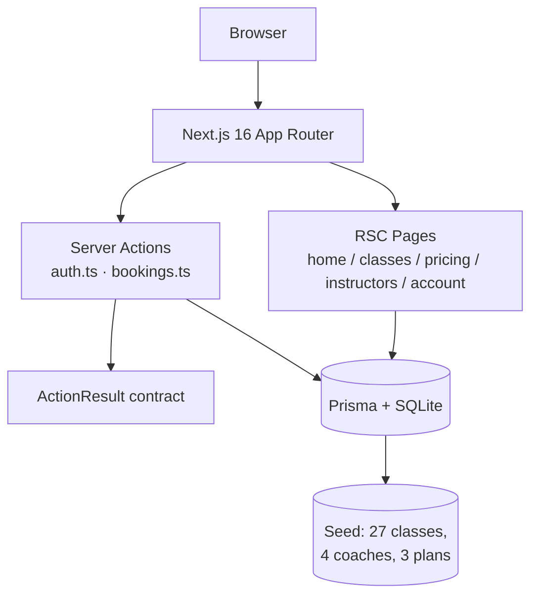

# AURA Studio — Fitness Studio Clone


A production-grade, pixel-faithful clone of the [AURA Studio](https://fitness-studio.base44.app) boutique fitness site — rebuilt from the ground up on Next.js 16 with real auth, a transactional booking engine, and a seeded weekly schedule, while preserving the source's editorial design (espresso/cream/butter palette, Taviraj + Inter typography).

## Overview

The original is a Base44 template app: a women-only fitness studio marketing site with a class schedule, memberships, and instructor profiles — but empty data and no booking persistence. This clone reproduces every surface **and makes it real**: scrypt-hashed credentials, session cookies, capacity-aware bookings that survive reloads, and an idempotent seed of 27 weekly classes across six disciplines.

## Key Features

| ✨ | Feature | What it does |
|---|---|---|
| 🏠 | **Marketing home** | Hero, free-week CTA, circular discipline dial (scrollspy + All-classes CTA), sky banner, coverflow benefits (below-stage arrow controls + dot rail; stacked on mobile), coaches accordion (rows of two, independent per row), testimonial spotlight (photo band with rotating flip-cards), gallery collage with lightbox |
| 📅 | **Class schedule** | TYPE / INTENSITY / DAY pill filters synced to the URL, live spots-left, empty state with clear-filters |
| 🔐 | **Email auth** | Sign-up / sign-in / password-reset with scrypt hashing and HMAC-fingerprinted session tokens |
| 📝 | **Transactional bookings** | Capacity + duplicate guards inside one DB transaction; book & cancel from the schedule and account page; re-booking a cancelled class re-activates the row (unique-key safe) |
| 💳 | **Pricing & memberships** | Seeded membership plans, class packs, policy pages |
| 🧑‍🏫 | **Instructor profiles** | Bios, specialties, certifications from the database |
| ♿ | **Accessibility** | WCAG 2.2 AA targets, keyboard-navigable carousel + lightbox, reduced-motion support |
| 🧪 | **Tested domain layer** | 32 Vitest tests over the pure booking-write-plan/filter/money/dial-rotation/spotlight/404-copy logic |
| 🧭 | **Source-measured UI** | Fixed hide-on-scroll header (inert closed menu), espresso page bands, source-matched 404 (slate platform screen, quoted path, full-viewport centered), legal pages at `/privacy` `/terms` `/accessibility` in the source's cream prose layout, footer with copyright hairline |

## Architecture

| Layer | Technology | Version | Purpose |
|---|---|---|---|
| Framework | Next.js (App Router) | 16.1 | RSC pages, Server Actions, Turbopack |
| UI runtime | React | 19 | Component model |
| Language | TypeScript (strict) | 5.x | Type safety end to end |
| Styling | Tailwind CSS (CSS-first) | 4.x | Token-driven design system in `globals.css` |
| Components | shadcn-style on Radix | — | Primitives (toast via sonner) |
| ORM | Prisma | 6.x | Schema, client, `db push` |
| Database | SQLite | — | Zero-config local persistence (`db/custom.db`) |
| Validation | Zod | 4.x | Every action input |
| Auth | hand-rolled (scrypt + HMAC) | — | No third-party dependency, no account-existence oracle |
| Tests | Vitest | latest | Pure domain seam |
| Fonts | Taviraj + Inter | via `next/font` | Self-hosted, no layout shift |



## File Hierarchy

```
📂 src/
  📂 actions/          ← Server Actions (auth, bookings) — async-only exports
  📂 app/              ← Routes: /, /classes, /pricing, /instructors, /login, /account,
  │                      /privacy, /terms, /accessibility (+ /legal/* redirects), not-found
  📂 components/site/  ← Header (fixed, hide-on-scroll, cream menu), footer, dial, coverflow,
  │                      accordion, testimonial spotlight, collage + lightbox,
  │                      schedule browser, auth card
  📂 lib/
    📂 auth/           ← scrypt passwords, HMAC session tokens
    📂 domain/         ← Pure logic: class-filters, booking-rules (write plans),
    │                     discipline-wheel, testimonial-spotlight, not-found (tested seam)
    📄 result.ts       ← ActionResult<T> contract
    📄 validation.ts   ← Zod schemas
  📄 app/globals.css   ← Design tokens (HSL) + custom utilities + keyframes
📂 prisma/schema.prisma ← User, Session, StudioClass, Instructor, Membership, Booking
📂 public/images/       ← Optimized photography (1600px, q82) incl. footer/packs backdrops
📂 scripts/seed.ts      ← Idempotent seed
📂 tests/domain.test.ts ← Vitest suite (32 tests)
📂 vitest.config.ts     ← Scopes the suite to tests/ (excludes scratch/)
📂 docs/                ← SSH push runbook + wrapper (repo ops), session logs,
                          and screenshots/ — dev-server captures of every route
📂 skills/              ← Documentation-generation skills used for this repo's docs
```

## Quick Start

Requirements: **Bun ≥ 1.1** (or Node ≥ 20 with npm — commands below are bun-flavored).

1. **Clone and install**
   ```bash
   git clone https://github.com/nordeim/fitness-studio-new.git
   cd fitness-studio-new
   bun install
   ```
2. **Configure the environment**
   ```bash
   cp .env.example .env
   # optional but recommended: replace the dev secret
   # macOS/Linux: printf 'SESSION_SECRET=%s\n' "$(openssl rand -base64 32)" >> .env
   ```
3. **Create and seed the database**
   ```bash
   bun run db:push
   bun run scripts/seed.ts
   ```
4. **Start the dev server**
   ```bash
   bun run dev
   ```

### Verify Setup

- `http://localhost:3000` renders the AURA home page: hero, free-week glow, discipline dial (click a wheel label — the page scrolls to that card and the dial rotates), coverflow benefits, coach accordion (click a portrait to expand), gallery collage (click a photo for the lightbox).
- `/classes` lists 27 seeded classes; clicking **YOGA** narrows to 8 and the URL becomes `/classes?type=YOGA` (values are case-insensitive — the home page links in as `?type=Yoga`).
- `/login` → **Create an account** → book any class → **My Bookings** shows it; cancel works.
- `/privacy`, `/terms`, `/accessibility` render the legal pages in the source's cream prose layout (centered `max-w-3xl` column, Title-Case serif h1, h2 sections); `/legal/*` permanently redirects to them; any unknown URL renders the source-matched slate 404 with the quoted offending path.
- `bun run lint && bun run test` → ESLint clean, 32/32 tests pass.

## Environment Variables

| Variable | Required | Description | Default |
|---|---|---|---|
| `DATABASE_URL` | yes | SQLite path, relative to `prisma/` | `file:../db/custom.db` |
| `SESSION_SECRET` | prod | HMAC secret for session fingerprints; rotating it invalidates all sessions | dev fallback (do not use in prod) |

## Testing

```bash
bun run test                     # full suite
bunx vitest run tests/domain.test.ts --reporter verbose
```

The suite covers: filter normalization (ALL/absent/unknown/case-insensitive values), schedule sorting, 12-hour clock formatting, booking write plans (create / deny DUPLICATE / deny CAPACITY_FULL / re-activate a cancelled row), the 2-hour cancellation window, money formatting (integer cents), defensive JSON-column parsing, the discipline-dial rotation math (label angles, dial counter-rotation, shortest-path deltas), the testimonial spotlight state machine, and the 404 quoted-path copy.

## Design System

| Token | Value | Usage |
|---|---|---|
| `--primary` | `hsl(21 93% 13%)` ≈ `#411401` | Espresso — buttons, headings, footer gradient end |
| `--background` | `hsl(40 25% 94%)` ≈ `#F4F1EC` | Warm cream page background |
| `--accent` | `hsl(57 100% 82%)` ≈ `#FFFAA4` | Butter yellow — free-week gradient |
| `--ring` | `hsl(15 52% 53%)` | Terracotta — focus rings, MEDIUM intensity |
| `--secondary` | `hsl(15 22% 84%)` | Taupe — section tints |

- **Typography**: Taviraj (light display headings — extralight in the hero; italic only for testimonial quotes and Inhale/Exhale) + Inter (body, tracked-out uppercase micro-labels via `.kicker` at `0.3em`).
- **Signature motion**: `.animate-breathe` (wordmark letter-spacing pulse, 7.2s), the discipline dial's scrollspy rotation, the coaches accordion spring, the footer wordmark glow — all disabled under `prefers-reduced-motion`.
- **Buttons**: 12px uppercase, `0.1em→0.2em` tracking on hover, 6px radius, arrow-up-right glyph.
- **Photography**: hero, four discipline cards, sky banner, coach portraits, seven-image gallery collage, plus the footer and class-packs backdrops — all optimized JPGs (1600px, q82).

## Deployment

```bash
bun run build    # production build
bun run start    # serve the build (set SESSION_SECRET first)
```

Deploy anywhere Node/Bun runs (Vercel, Fly, Render, Docker). The SQLite file works for single-instance deployments; swap `DATABASE_URL` to Postgres and change the `provider` in `prisma/schema.prisma` for horizontal scale — the schema is otherwise portable.

## Contributing

- Pure domain logic goes in `src/lib/domain/` **with tests first** (red → green); UI wiring goes in `src/components/site/`.
- `bun run lint && bun run test` must pass before every commit.
- Conventional Commits (`feat:`, `fix:`, `docs:`); `main` only.
- Never commit `.env`, `db/*.db`, or SSH keys.

## License

No `LICENSE` file is present; the repository is all-rights-reserved by default. The original design and copy belong to the source app (`fitness-studio.base44.app`); this rebuild is for the repo owner's own use.

## Credits

- Original design & copy: [fitness-studio.base44.app](https://fitness-studio.base44.app) (Base44 template).
- Rebuilt with Next.js 16, Tailwind v4, Prisma, and the scandihaven architecture invariants (ActionResult contract, integer money, pure domain seam).
